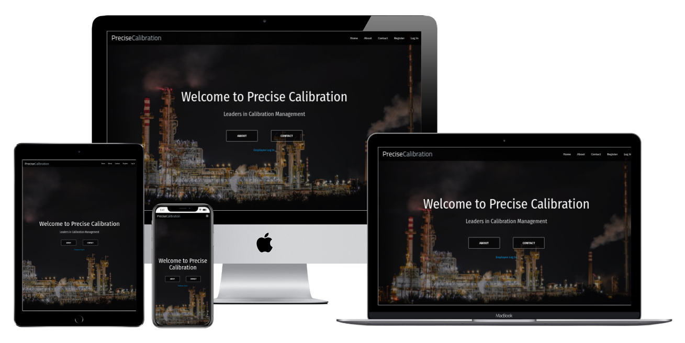
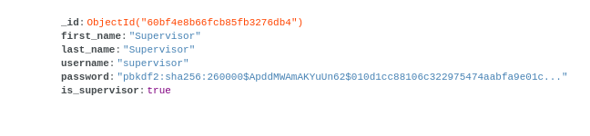
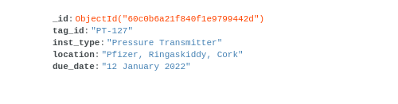
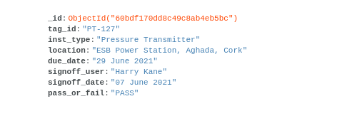
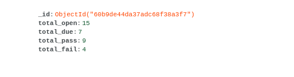
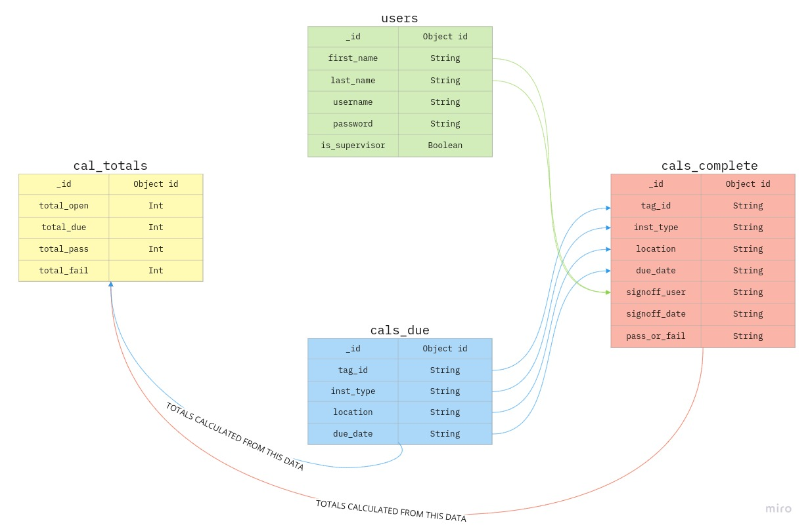

# Website for Precise Calibration



## Code Institute Milestone Project 3 : Data Centric Development

Precise Calibration is a fictional company that provides calibration services for process instrumentation equipment. Some examples of this equipment would be pressure or temperature sensors in a pharmaceutical plant or oil refinery that require regular routine calibration for reasons of regulatory compliance. The website will feature a landing page with information about the company and its services with the goal of acquiring new customers. It will also contain a secure application for employees where they will be able to log in and keep track of work that is due for completionto ensure jobs are completed on time. This application will allow employees to make use of a database and CRUD operations to keep the calibration management system up to date.

A link to the live website can be found [here.](https://precise-calibration.onrender.com/)

## Table of Contents

- [User Experience (UX)](#ux)
- [Database Schema](#database-schema)
- [Features](#features)
- [Technologies Used](#technologies-used)
- [Testing](#testing)
- [Deployment](#deployment)
- [Credits](#credits)

## UX

### Strategy

The website for precise calibration will be designed with two sets of users in mind. First there are the potential customers of the services that precise calibration have to offer. These potential customers will be interested in viewing what services can be provided and how it may benefit them from a business perspective. Potential customers may be owners of a small business or they may be managers or supervisors in a larger business that requires regular routine instrument calibration services. The landing page be easy to navigate and will have a professional feel to it with all information clearly presented so as not to cause any confusion to potential customers.

The other set of users are the employees of precise calibration. Each employee will register their own personal login credentials to gain access to the calibration management application on the website. The purpose of this application is to reduce time filling out paperwork and sending emails as all information will be automatically updated to the database where a supervisor will be able to view the completed work and close out tasks. This application will contain a list of all instruments that are due for calibration and some information regarding the instrument (due date, tag id, location, instrument type). When an instrument has been calibrated employees will be able to mark the job as complete and if it has passed or failed and this information is then updated on the database. All information regarding instruments (due-date, location, tag-id etc.) needs to be clearly displayed and all buttons for CRUD functionality will need to be clearly labelled. At no point when using the application should employees feel confused or lost as this could lead to user input errors which would affect the efficiency of the application. 

The website will be designed for both mobile and desktop but will be targeted more towards desktop / laptop users as they are the norm in a professional setting and it is much easier to read and input information on a larger screen.

#### As a potential customer I want to:
- view the website on various devices (mobile, tablet, desktop)
- be able to instinctively navigate the website to efficiently find the information required
- be able to contact Precise Calibration with any queries about the services they are offering
- be easily directed to any social media channels to connect / network with Precise Calibration 

#### As an employee I want to:
- easily register an account
- be able to log in and log out without difficulty
- be able to search for specific instruments
- update the status of an instrument when calibration is complete (Pass / Fail)
- add new instruments to the calibration list as required
- remove instruments from the application when calibration is complete and closed out

### Scope

After analysing the user stories, I have decided to use the following features as my initial minimum scope.
- Responsive design
- Landing page with company information (services, contact info, social media)
- Employee account registration
- Log In / Log Out functionality for registered employees
- Calibrations Due section listing all instruments currently due for calibration with search functionality
- Calibrations Complete section visible by users with supervisor level access where they can review completed tasks
- CRUD functionality throughout the app 

### Structure

I did some research on websites belonging to companies that provide similar engineering and calibration services and I found that some websites did not look very appealing and looked a bit out dated. There were a few others with a more modern design which I found much more professional and eye-catching so I chose to go with a similar design for my landing page.

I also did some research on instrument calibration tracking software to get an idea of what employees may be used to working with. I found that with a lot of these applications that although the information fields used are common to my own application, the user interface was very basic and outdated. I decided to go with a more modern looking design that still keeps the same functionality as these other applications but with a cleaner and more legible presentation so as to avoid employees getting lost or confused.

Both the landing page and the employee application are designed to be easy to navigate, with all information presented in a clean manner so that users will have a familiar and enjoyable experience.

I have structured the website with:
- A brand logo on the top left of the page and a navbar to the right which is common to most websites
- A collapsible navbar with a hamburger icon for smaller screen sizes
- Navbar common to all pages - items displayed on navbar depending on access level (supervisor access)
- Main content written with MaterializeCSS for structure and responsive design
- Landing Page, Register and Log In pages accessible by all users of the website
- Calibrations Due and Calibrations Sign Off pages accessible by all logged in employees
- Add, Edit and Completed Calibrations pages accessible by employees with supervisor access

### Skeleton 

I designed wireframes for desktop, tablet and mobile using Balsamiq. These wireframes can be viewed [here.](https://github.com/shaneoh10/precise-calibration-ms3/tree/master/assets/wireframes)

### Surface

#### Colours
I decided to go with a neutral color palette for the website to keep it looking professional and so as not to distract the users while they are reading through or inputting information. I used brighter green and red colours for the Pass/Fail indicators on the dashboard page so that they will stand out to the users. The main buttons are blue for positive interactions (Log in, upload etc.) and red for negative interactions (cancel, delete etc.). This makes it easier for users to distinguish between which type of action they are trying to take while using the application and it also provides a good contrast from the neutral colour palette of the rest of the website.
- #F8F9FA - Cultured (off-white) 
- #E9ECEF - Cultured (off-white)
- #ADB5BD - Wild Blue Yonder
- #495057 - Davys Grey
- #343A40 - Gunmental

#### Typography
I chose 'Fira Sans Condensed' as the main font for the project as it is easy to ready and gives the website a competent and professional feel to it.

## Database Schema

I am using MongoDB, which is a NoSQL database for this project. There are two entitites stored in the database which are user data and calibration data. The user data contains information like the user's name which is used when signing off a calibration and also the user's login details which are used to access the application and determine the access level granted. The calibration data includes instrument type, instrument location, due date, instrument tag id etc. which is all added to the databse by users. There is also a collection with calibration totals which is automatically incremented up or down on the database depending on the type of action carried out by the user.

### Database Structure
The database contains four collections:
- users
- cals_due
- cals_complete
- cal_totals

#### Users 

| MongoDB users Collection |
| -------- |
||

- This collection holds all of the user data

|  Key  |  Data Type | Notes |
| ------| ---------- | ----- |
|  `_id`  | Object Id  | This is automatically generated by MongoDB and is unique to each document. |
|  `first_name`  | String  | The first name of the user as entered on registration. This is used along with last_name when a user is signing off a clibration. Each completed calibration has a field containing the name of the user it was completed by. When a user logs in this is added to a session cookie `session["name"]` so it can be easily retrieved and attached to the calibration signoff form |
|  `last_name`  | String  | The last name of the user as entered on registration. This is used along with first_name when a user is signing off a clibration. Each completed calibration has a field containing the name of the user it was completed by. When a user logs in this is added to a session cookie `session["name"]` so it can be easily retrieved and attached to the calibration signoff form | 
|  `username`  | String  | The username chosen by the user upon registration. This username is required when the user wants to log in to access the application. When the user logs in this username is assigned to a session cookie `session["user"]` and the level of access granted is based on the data that is attached to that username on the DB |
|  `password`  | String  | This is the pasword chosen by the user upon registration. This password is required along with the username when logging in to the application. The password is hashed by werkzeug for secure password storage |
|  `is_supervisor`  | Boolean | This is either true or false depending on whether a user is a supervisor or not. This value is added to a session cookie `session["is_supervisor"]` so that it can easily be checked by the application. Supervisor access is required to view certain pages and to edit/delete certain documents. The application will check if this value is true or false and grant access appropriately. The value of is_supervisor is automatically assigned as false and can only be changed by logging in to the database on MongoDB.com as a form of protection for the application |


#### Calibrations Due

| MongoDB cals_due Collection |
| -------- |
||

- This collection contains the data on calibrations that are due for completion

|  Key  |  Data Type | Notes |
| ------| ---------- | ----- |
|  `_id`  | Object Id  | This is automatically generated by MongoDB and is unique to each document. |
|  `tag_id`  | String  | This is the tag id of the instrument which is local to the site that the instrument is located on. This tag is used as an identifier for the instrument that is to be worked on |
|  `inst_type`  | String  | This is the type of instrument that is to be worked on. Generally the instrument type is the same as the varible which it measures (Flow, Temperature, Pressure etc.) |
|  `location`  | String  | The location of the instrument that is to be worked on. The site address is entered in this field |
|  `due_date`  | String  | This is by which the requested work has to be completed. On the application this is converted to a datetime object and compared against a delta of 7 days which in turn will notify users that the work is nearing due date |


#### Calibrations Complete

| MongoDB cals_complete Collection |
| -------- |
||

- This collection contains the data on calibrations that have been signed off but are still on the database awaiting review to be closed out

|  Key  |  Data Type | Notes |
| ------| ---------- | ----- |
|  `_id`  | Object Id  | This is automatically generated by MongoDB and is unique to each document. |
|  `tag_id`  | String  | This is the tag id of the instrument which is local to the site that the instrument is located on. This tag is used as an identifier for the instrument that is to be worked on |
|  `inst_type`  | String  | This is the type of instrument that is to be worked on. Generally the instrument type is the same as the varible which it measures (Flow, Temperature, Pressure etc.) |
|  `location`  | String  | The location of the instrument that is to be worked on. The site address is entered in this field |
|  `due_date`  | String  | This is by which the requested work has to be completed. On the application this is converted to a datetime object and compared against a delta of 7 days which in turn will notify users that the work is nearing due date |
|  `signoff_user`  | String  | The name of the user that was logged in and signed off the calibration as complete. This data is taken from a session cookie `session["name"]` which is created with the users first and last name upon login |
|  `signoff_date`  | String  | The date that the user signd off the calibration as complete. The datetime python library is used to get the current date and it is converted to a string before being uploaded to the database |
|  `pass_or_fail`  | String  | This is the result of the calibration work carried out by the user. The user checks either the Pass or Fail radio button when completing the calibration signoff form |


#### Calibrations Totals

| MongoDB cal_totals Collection |
| -------- |
||

- This collection contains the total number for calibrations stored on the database for various data points

|  Key  |  Data Type | Notes |
| ------| ---------- | ----- |
|  `_id`  | Object Id  | This is automatically generated by MongoDB and is unique to each document. |
|  `total_open`  | Int  | The total number of calibrations that are active on the system (have not been closed out yet). This is the total of cals_due + cals_complete and is incremented as required when any changes are made to the database, for example, deleting a calibration or closing out a completed calibration |
|  `total_due`  | Int  | This is the total number of calibrations due that are on the system. This total is incremented as required when any changes are made to the DB, for example, deleting a calibration or signing off a calibration as complete |
|  `total_pass`  | Int  | The cumulative total number of instruments that have passed a calibration. This number is incremented each time a calibration is signed off as a pass |
|  `total_fail`  | Int  | The cumulative total number of instruments that have failed a calibration. This number is incremented each time a calibration is signed off as a fail |

### Database Relationships

Each collection in the database is in some way linked to another collection. This image represents the relationships between each of the collections.



## Features 

The website features a main landing page which is accessible to all users and it has a calibration management application which is only accessible by logging in to the system. There are two access levels for users of the calibration management application which are standard level and supervisor level. Some features are only available to standard users (calibration signoff) and some features are only available to supervisor users (add new, delete, edit). All new accounts created are automatically set as standard user accounts and for security reasons can only be changed to supervisor level by modifying the user data directly on the database at MongoDB.com. This ensures that users can not create a supervisor level account and manipulate the stored data, which could be disastrous from a business point of view. The following credentials can be used to view the application with supervisor level permissions.
- Username: supervisor
- Password: supervisor

### Across all pages: 
- The navbar will be visible at the top of the page across all pages of the website. The navbar has the Precise Calibration logo on the left and there are multiple navigation items on the right-hand side: Home, About, Contact, Register, Log In, Log Out, New Cal, Cals Due, Dashboard. These navigation items are not always displayed on the navbar, they are dependant on whether a user is logged in or not, the user's access level and what page the user is on. The navbar collapses into a hamburger icon on smaller screens and the navbar pops out from the side of the screen.
- When a user is logged in, just below the navbar their name will be displayed along with a user-check icon to notify the user that they are logged in to their account. 

### Home Page: 

#### Header
- There is a high quality background image of an oil refinery, which makes it immediately apparent to users that the website has an industrial/manufacturing subject to it.
- A main heading welcoming users to the website quickly draws user attention to this area of the page and a sub-heading provides a brief description of the services offered (Calibration Management services)
- Below the headings are two buttons, About and Contact. These buttons encourage users to either browse the rest of the website to learn about the services on offer or contact the company directly for more information. The buttons change colour on hover to provide feedback to the user.
- There is a smaller link to the employee login page below the two buttons, this link is smaller in size so as not to distract potential customers from the main content of the page.

#### About Section 
- There is a paragraph providing users with information about the company and the services they provide. This description is brief but it gives users enough information to understand what the company does and what sectors they work in. There is also information on the certificates that the company holds which are a requirement to work in some sectors.
- Below the paragraph are three cards with images giving a brief description of some of the sectors Precise Calibration work in. This makes the website look professional and the brighter colours of the images will attract the user's attention.

#### Contact Section
- This section has a background image of piping and instruments in a process plant, further reinforcing the subject of the website.
- There are two cards with contact details for both of Precise Calibration's offices so that users can contact either office with any questions they have about the services on offer.

#### Footer
- Located at the bottom of the page, this contains social media links and a copyright notice.
- The footer is only displayed on the home page as I believe it could serve as a distraction to employees while inputting data in the calibration management application and the information provided in the footer is not required while using the app.

### Register Page:
- This page contains a registration form where users will input thier first name, last name, username, password and repeat password to create a new account. When the user clicks the register button, the app checks if the username chosen is already in use. If the username is already in use a message explaining so will be flashed to the user, if not already in use the app will then check that the passwords entered are matching. There is an indicator below the repeat password input notifying users if the passwords do not match, but if users ignore this and try to submit the form a message will be flashed explaining that the passwords do not match. When all validation has passed, the user data from the form will be stored as a in the user collection in database and the user will be redirected to the home page where they will be prompted to log in.
- Below the form is a link to the log in page for users that already have an account and may have accidentally clicked on the register page.
- The cancel button will return users to the home page if they do not wish to register an account.

### Log In Modal 
- The log in modal contains a form that requests a username and password to log in to the application. When a user enters a username and password, the app will first check that the username exists and if so, it will then check that the password provided matches that which is stored on the database for that user. If the username does not exist or if the password is incorrect a flashed message will appear notifying the users that the username and/or password is incorrect. The same flashed message will appear for both instances. For security reasons we do not want to notify users if they have entered either one of the username or password correctly.
- When the user successfully logs in, standard level users will be redirected to the cals due page and supervisor level users to the dashboard and the user's details will be added to session cookies ( `session["user"] , session["name"] , session["is_supervisor"]` ). A flashed message will then appear, welcoming the user by name to the application.
- Below the form is a link to the register page for users that do not have an account and are looking to register one so that they can log in.

### Log Out function
- The log out button is displayed in the navbar at all times when a user is logged in. When the user clicks the log out button, the application clears all session cookies, redirects the user back to the home page and displays a flashed message confirming that the user has successfully logged out.

### New Cal Page
- This page is only accessible with supervisor level access.
- It contains a form which requests information about a new calibration that is to be added to the system. This information is typically provided to the company by customers and then the supervisor will add this information to the application so that employees can view the information on the jobs that are to be completed.
- There is basic validation which requires that all fields are filled out correctly before the for will submit. Users will be prompted by each input if they are not filled out correctly or by a flashed message if the input passes the local input validation but not the application's validation. The new calibration is then uploaded to the database to the cals_due collection and the user is redirected to the calibrations due page where they will see a flashed message confirming that the calibration has successfully uploaded.

### Cals Due Page
- This page is only accessible by logging in with standard or supervisor access.
- At the top of the page there is a search bar that is set up to return results all four indexes of the cals_due collection (tag_id, inst_type, location, due_date). The search will query the database collection and return results that match for any of the four indexes. If no results are found the page will display "No results found". The clear search button will reload the cals due page without any search query, displaying all calibrations again.
- Below the search bar each instrument that is due for calibration from the cals_due collection is displayed in a list ordered by due_date ascending. Each item in the list contains all the data for each specific instrument stored in a collapsible card which drops down when the user clicks on it. On each card header a "due soon" warning will appear if the instrument is due for calibration in less than 7 days, to notify employees of the urgency of the task.
- When the list items are dropped down, the user can view all the data stored for that instrument and there are buttons available for action depending on the level of access granted to the user. For standard users there is a "Signoff" button which will redirect the user to the calibration signoff page. For supervisor users there is a button to edit the information which will redirect the user to the edit page and a delete button which will raise a prompt to confirm deletion and then delete the instrument from the cals_due collection in the database.

### Cal Signoff Page
- This page is only accessible by logging in with standard access.
- This page contains a form with all the information about the instrument that the employee is requesting to sign off as complete. This information is all added to the form automatically and is presented as readonly so that users can not modify any of the data, it is presented so that users can verify that they have chosen the correct instrument to sign off and that they are logged in as the correct user.
- The user then has an option of two radio buttons "PASS" or "FAIL", from which they must choose one to record the result of the calibration they have completed.
- When the user submits the form they are confirming that the work is complete. The data is then uploaded to the cals_complete collection and removed from the cals_due collection on the database.
- After the form has been submitted successfully, the user is redirected back to the cals due page and a flashed message confirms that the calibration has been signed off.

### Edit Cal Page
- This page is only accessible with supervisor level access.
- This page contains a form that is automatically filled with the data of the calibration of which they want to edit. The users can make any changes they want in the form as long as it passes the validation requirements.
- When this form is submitted it updates the information for that specific calibration in the cals_due collection on the database.

### Dashboard 
- This page is only accessible with supervisor level access.
- This purpose of this page is to present an overview of all the data recorded by the system to supervisors.
- At the top of the page there are four cards, each displaying the total number of calibrations recorded for four different headings (Open Cals, Cals Due, Passed, Failed). As these numbers are recorded on the database they are automatically updated as required when any changes are made to the database.
- Below this there is a section where all the completed calibrations (calibrations that have been signed off by users) are presented in a list. Each calibration has an indicator displaying if it has passed or failed and a collapsible dropdown that contains all data as was uploaded to the database when the calibration was signed off.
- At the bottom of the collapsible dropdown there is a button to close out the calibration. When the supervisor has reviewed and is satisfied with the information provided for each calibration, they can press this button to close out the calibration, removing it from the system. A prompt will appear to confirm the close out of the calibration and the data will then be deleted from the database.
- Above the list of completed calibrations there is a toggler which allows users to choose between viewing all, passed or failed calibrations.


## Technologies Used

- HTML5 - This is the main language of the website content
- CSS3 - This is used to style the web pages
- Python 3 - The main application to run the website and use CRUD functionality is written in this language
- JavaScript, jQuery - Used for visual effects, interactivity, DOM manipulation
- [Flask](https://flask.palletsprojects.com/en/2.0.x/) - Microframework that provides tools, libraries, and technologies to build the web application
- [Jinja](https://jinja.palletsprojects.com/en/2.11.x/) - Templating language used with Python and Flask. Allows quick building of pages and reduces code repetition.
- [Werkzeug](https://werkzeug.palletsprojects.com/en/1.0.x/) - Used with Python for security of the web application, password encryption
- [MongoDB](https://www.mongodb.com/) - Used to store all the data for the web application
- [PyMongo](https://pymongo.readthedocs.io/en/stable/) - Python module used to interact with MongoDB database.
- [Materialize v1.0.0](https://materializecss.com/) - The project uses Materialize elements to help with structure and design
- GitHub - Used to store the code, linked to Heroku for automatic deployment
- Heroku - Platform used to deploy the web application
- Gitpod - This is the IDE I used for the project
- Git - Used within Gitpod as the version control system
- Chrome Developer Tools - Used within Google Chrome to inspect the web pages. This is helpful when designing responsive features and troubleshooting bugs.
- Balsamiq - I created the project wireframes with this software
- Google Fonts - Used to import the fonts for the project
- [Miro](https://miro.com/online-whiteboard/) - This is an online whiteboard I used to sketch the database relationships
- [ScrollReveal](https://scrollrevealjs.org/) - Used for the divs appear on scroll down effect on the home page
- [Font Awesome](https://fontawesome.com/) - Used to import icons
- [Techsini](https://techsini.com/) - Used this website to generate the multi-device website mockup

## Testing 

Information on testing can be found in [TESTING.md](TESTING.md)

## Deployment 

### Github Setup 

I first set up the Precise Calibration repository on GitHub using the following steps:
1. To set up the initial repository I used the [Code Institute Template.](https://github.com/Code-Institute-Org/gitpod-full-template) I clicked on "use this template" and entered precise-calibration-ms3 as the repository name and set it to public.
2. In the new Precise Calibration repository I clicked on the GitPod button to open the project up as a new GitPod workspace.
3. Throughout the project I saved all my code to Git by typing `git add .` into the terminal in the GitPod workspace.
4. To commit the code to git I used the command  `git commit -m "<add comment here>" `
5. Using Git I then used the command `git push` to push all the committed code to my GitHub repository at [https://github.com/shaneoh10/precise-calibration-ms3](https://github.com/shaneoh10/precise-calibration-ms3)

#### Cloning the repository

The project can be downloaded as a .zip file by clicking on the "Code" button in the project repository and then clicking "Download ZIP". 

Alternatively the project can be cloned by entering `git clone git@github.com:shaneoh10/precise-calibration-ms3.git` in the terminal. 

More information on cloning the project can be found [here](https://docs.github.com/en/free-pro-team@latest/github/creating-cloning-and-archiving-repositories/cloning-a-repository).

#### Running the project locally 

Once the project has been cloned you can run it locally using the following steps:
1. From the root directory enter the following prompt into the terminal to install the project requirements: 
```
pip3 install -r requirements.txt
```
2. Create an eny.py file to store the project configurations. Enter the following into the env.py file:
```
import os

os.environ.setdefault("IP", "0.0.0.0")
os.environ.setdefault("PORT", "5000")
os.environ.setdefault("SECRET_KEY", "<YOUR_SECRET_KEY>")
os.environ.setdefault("MONGO_URI", "<YOUR_MONGO_URI>")
os.environ.setdefault("MONGO_DBNAME", "<YOUR_MONGO_DBNAME>")
```
3. Ensure that your `env.py` and `__pycache__` files are added to your .gitignore file as these contain sensitive information that should not be uploaded to the repository
4. To enable debug mode go to the last line of the `app.py` file and change `debug=False` to `debug=True`
5. The app can now be run locally using the following command in the terminal:
```
python3 app.py
```

### Heroku Deployment

Before deploying to Heroku, ensure that you have both a `Procfile` and `requirements.txt` in your local repository or the application will fail to run.
- You can enter the following commands in the terminal to ensure your `Procfile` and `requirements.txt` both contain the relevant setup info required by Heroku to run the app:
```
echo web: python app.py > Procfile
```
```
pip freeze > requirements.txt
```
When this is complete you can log in to Heroku and create a new application with the following steps:
1. Click on the new button and choose "Create New App"
2. Choose a name for the application
3. Choose the relevant region
4. Click on the Create App button

Now that the new app has been created you can connect it to your GitHub repository with the following steps:
1. Click on the Deploy tab and then choose GitHub as the deployment method
2. Enter your GitHub repository name and click search
3. You can then click connect when the project has been found. Your project is now connected to your GitHub repository.
4. To allow automatic deployment each time your GitHub repository is updated click on "Enable Automatic Deploys"

The final step is to set up your environment variables the same as in your `env.py` file:
1. Click on the settings tab to access the application settings
2. Click "Reveal Config Vars"
3. Enter the key value pairs exactly as they are in your env.py file without any quotation marks as follows:
```
IP: 0.0.0.0
PORT: 5000
SECRET_KEY: <YOUR_SECRET_KEY>
MONGO_URI: <YOUR_MONGO_URI>
MONGO_DBNAME: <YOUR_MONGO_DBNAME>
```
The project should now be deployed on Heroku and you can view it by clicking on the "Open app" button at the top of the page.

## Credits

### Code:
- I used multiple templates from [Materialize](https://materializecss.com/) throughout the project (navbar, cards etc.). These are referenced by comment in the code where they have been used.
- I copied the code from [here](https://www.w3schools.com/howto/howto_js_navbar_hide_scroll.asp) to implement the navbar hide on scroll down and appear on scroll up effect on the home page.
- I used the documentation and code from [ScrollReveal](https://scrollrevealjs.org/guide/whats-new.html) to set up the scroll reveals divs effect on the home page.
- I based code on [this article](https://stackoverflow.com/questions/53063672/expand-all-and-collapse-all-collapsible-accordion-materialize-css/53064634) to automatically close all accordion dropdowns when toggling through all, passed and failed calibrations in the dashboard.
- I used [this article](https://stackoverflow.com/questions/10233550/launch-bootstrap-modal-on-page-load) for assistance with getting the flashed messages to appear on a modal.
- Throughout the project I referenced the documentation for [Flask](https://flask.palletsprojects.com/en/2.0.x/) and [Jinja](https://jinja.palletsprojects.com/en/2.11.x/) to get the main application structure in place. I also referenced the Code Institute Task Manager project for guidance.
- When implementing the security features I based the login required function decorators on code from [here](https://blog.teclado.com/protecting-endpoints-in-flask-apps-by-requiring-login/) and I also referenced the [Werkzeug](https://werkzeug.palletsprojects.com/en/1.0.x/) documentation.
- For assistance when working with the database I referenced the documentation from [PyMongo](https://pymongo.readthedocs.io/en/stable/) and referenced the Code Institute Task Manager project.
- I referenced the Python documentation [here](https://docs.python.org/3/library/datetime.html) for help with using the Python datetime library.
- [Stack Overflow](https://stackoverflow.com/) - There are many helpful posts on stack overflow that helped me with solving problems that I encountered during the development of the project.

### Images:
All the images used in the project were sourced from [Unsplash](https://unsplash.com/)
- [Tasos Mansour @mantasos](https://unsplash.com/photos/NRfNe4ys_bM)
- [Robin Sommer @robin_sommer](https://unsplash.com/photos/wnOJ83k8r4w)
- [Bill Oxford @bill_oxford](https://unsplash.com/photos/tR0PPLuN6Pw)
- [Lars Kielne @larskienle](https://unsplash.com/photos/tR0PPLuN6Pw)
- [Crystal Kwok @spacexuan](https://unsplash.com/photos/mhUsz2ezlXQ)

### Acknowledgements 

I would like to thank my mentor Spencer Barriball for his help and guidance throughout the project. I would also like to thank Code Institute and the Slack community for providing me with knowledge, ideas and inspiration on to how to approach this project.
