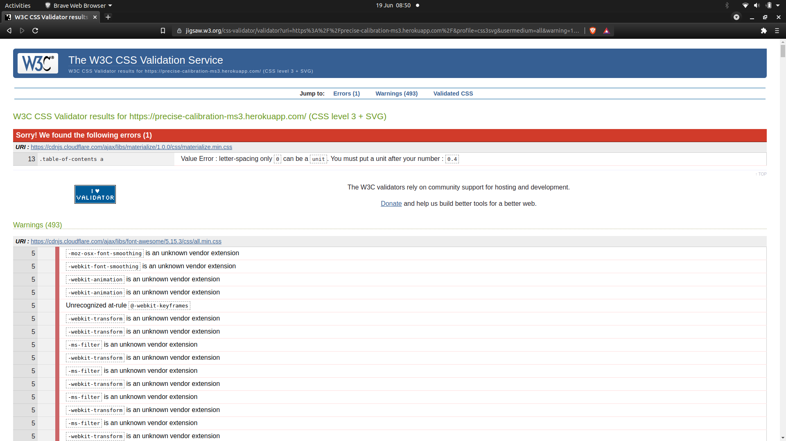

# Pecise Calibration - Testing

[Back to README.md](README.md)

## Chrome Developer Tools

I used Chrome Developer Tools throughout the development of the project to assist with the design and layout of each page. This is a great tool to use when implementing or making changes to HTML and CSS code as it allows you to test various font sizes, margin, padding etc. before committing any changes to the project. I also found it very useful to help me find exactly which elements needed to be targeted in the DOM when making visual changes to the pages (JQuery effects, media queries etc.). I am satisfied with how the website turned out and I think it is clear and easy to read on mobile, tablet and desktop. Overall, I would have to say the best experience is on larger devices (desktop, laptop), which would be the intended device to use the application on in a real setting.

When testing the responsiveness of the website I encountered an issue with the positioning of the due-soon span on mobile devices. 


As the primary use for the application is on larger screen sizes, I decided to implement a media query to set `display: none` on the due-soon span on mobile devices. The due-soon span will now only appear on devices with screen width of greater than 600px so that it does not interfere with the appearance of the page. I also had a similar issue on the dashboard with the pass/fail spans and implemented the same solution.

### Lighthouse 

I ran tests with lighthouse across all of the pages for both desktop and mobile. Below is an example of some of the errors that were found in these tests:


I was able to fix most of the errors across all pages but there is an error outstanding as seen in the image above: "Links do not have a discernible name". This error is present on pages that have the form with the dropdown selector (new cal, edit cal,cal signoff) and it brings the accessibility rating down from the green zone. Upon investigation I found that the element in which the error exists is not part of my own html but is loaded to the DOM by Materialize when the page loads, so I decided to take no further action as it does not interfere with the operation of the website.

Besides this issue, all remaining pages have green lighthouse ratings across all parameters for mobile and desktop. 


## Validation

### W3C Validator

#### HTML

I ran HTML validator tests throughout the development of project with the W3C Validator. See below some of the errors that were caught.


I investigated and refactored the code to fix these errors and on the final tests there were no errors found in the HTML across the website.

#### CSS

When testing the CSS with the validator the following errors and warnings were found.



These errors and warnings are found in the Materialize CDN and the Fontawesome CDN and are therefore out of my control. To bypass these CDN files and to get a more accurate result I tested my own CSS files by direct input into the validator and the following result was returned.


This test result shows that I was using an invalid value for the vertical-align property, which I promptly fixed. After fixing this error there were no more errors found in the CSS files.

### JSHint

I ran all the JavaScript code through JSHint and I found a few errors which I was able to easily resolve.

- There were multiple counts of 'missing semicolon' which was an easy fix
- There are multiple counts of undeclared variable which can be ignored. These variables are declared in external resources (JQuery, ScrollReveal, Materialize)
- There are multiple warnings which remain present in the files about the use of `let` and `const` in JS version ES6 as follows: `let' is available in ES6 (use 'esversion: 6') or Mozilla JS extensions (use moz).` I found an article on stack overflow [here](https://stackoverflow.com/questions/27441803/why-does-jshint-throw-a-warning-if-i-am-using-const) that advises by adding `/*jshint esversion: 6 */ ` at the top of the javascript files it would clear this error. I implemented this solution while testing in JSHint and the warnings were no longer present.

## Web Browser and Device Testing

I tested the functionality of the website across a number of browsers and devices to verify that the website is responsive and the code is supported across different browsers.

- Browsers tested:
    - Google Chrome
    - Brave
    - Firefox
    - Microsoft Edge

- Devices Tested:
    - Laptop
    - Desktop
    - Samsung Galaxy S20
    - iPhone 12

When carrying out the browser testing, I found that the flashed message modal was not popping up when it should be on all browsers. I used Google Chrome for the development of the project and this issue did not exist in this browser, so I only came across this issue while testing other browsers. After a bit of troubleshooting, I discovered that the problem was in the JavaScript code in the `script.js` file, that I was using to open up the modal when the page loaded: 
```
$(window).on('load', function () {
    $('#modal1').modal('open');
});
```

I changed the above code to the code below and the modal is now working across all browsers
```
$(document).ready(function () {
    $('#modal1').modal('open');
});
```

All website features are now working across all browsers and devices tested and the website is responsive on all devices. 

## Testing User Stories

### Potential Customers 

#### I want to be able to view the website on various devices (mobile, tablet, desktop)
- The website has been tested on multiple devices and tested for responsiveness in Chrome developer tools so the users should be able to view the website on a variety of devices.

#### I want to be able to instinctively navigate the website to efficiently find the information required
- As the user scrolls through the home page, all information is displayed in a neat fashion and there are navigation buttons in the navbar and on the home page header to take users to their desired section.
- The navbar has an effect where if the user scrolls down through the page, as soon as they begin to scroll back up the navbar will appear again to assist with navigation of the website.
- I individually tested all of the buttons and navbar links to verify that users are redirected to the correct section/page.

#### I want to be able to contact Precise Calibration with any queries about the services they are offering
- There is a contact section in the home page which contact contains information for two of Precise Calibration's Offices.
- In the contact section users can see an address, email, and phone number for each office so that they can easily contact or visit Precise Calibration's offices.

#### I want to be easily directed to any social media channels to connect / network with Precise Calibration
- In the footer at the bottom of the home page, there are social media icons which are cleary displayed to the user.
- I tested each icon individually to verify that when clicked they open up the correct social media website in a new tab.

### Employees

#### I want to be able to easily register an account
- On the home page there is a link in the navbar to go to the register page
- The register page contains a form with all inputs clearly labelled so the user should have no difficulty in figuring out what information they are required to input.
- There is input validation in the form so if users enter any information incorrectly they will be prompted to where the error exists and the form will not send until this is fixed.
- If the username they have chosen is already in use by another user, a flashed message will appear notifying the user to choose another username.
- I forced errors to test that all the prompts for invalid input are working and that the flashed message for the username already existing on the database is working correctly.
- I then tested with valid information to ensure that new user accounts are registered correctly and stored on the database and all is working OK.

#### I want to be able to log in and log out without difficulty
- On the home page there is a link in the navbar and another link in the center of the page, both clearly labelled as log in links.
- When the user clicks on a log in link, a modal appears on the page requesting a username and password to log in to the application.
- The user enters their log in credentials. If the credentials are valid the user is redirected into the application, if invalid the user is notified via a flashed message that the credentials are incorrect.
- At all times when a user is logged in, there will be a log out button available in the navbar. This button logs the user out, redirects them to the home page and notifies them that they have been successfully logged out.
- I have tested the functionality of the log in modal with valid and invalid credentials to ensure it operates as intended.
- I have also tested the log out functionality and all is working OK.

#### I want to be able to search for specific instruments
- On the cals due page there is a search bar at the top of the page where users can search the database of calibrations due
- The search bar returns results on all four indexes for each item (Tag ID, Instrument Type, Location, Due Date). I tested the search functionality for each index and results were returned as intended.
- If the search returns no results the user is notified that no results were found. I also tested this and it functions as intended.
- There is a clear search button which refreshes the cals due page without a search query and this has also been tested and is working.


#### I want to be able to update the status of an instrument when calibration is complete (Pass / Fail)
- For each instrument in the Cals Due page, when the user clicks on the instrument they are presented with all the information on that instrument and also a "Sign Off" button .
- This sign off button will only be visible to users with standard access so as to reduce the possibility of fabriction of results. I tested this by logging in to a standard level account and a supervisor level account and it works OK.
- When a user clicks the sign off button, they are redirected to the sign off page which contains a pre-filled read only form with the information of the instrument they want to sign off.
- The user then chooses a radio button (PASS / FAIL) and submits the form to update the calibration status of the instrument.
- I tested that the "Sign Off" button returns the correct instrument information and that the form submits the information to the database correctly and all is working OK.

#### I want to be able to add new instruments to the calibration list as required
- There is a "New Cal" link in the navbar that is only available while logged in at a supervisor level, which I have tested and verified.
- This redirects the user to the New Cal page which contains a form with clearly labelled inputs for the user to input information on the new calibration they want to add to the list.
- There is input validation in the form so if users enter any information incorrectly they will be prompted to where the error exists and the form will not send until this is fixed.
- When the user fills out the form correctly and submits it, the information is uploaded to the database and the new calibration will appear in the list of calibrations on the cals due page.
- I have tested the functionaliy of the form validation and interaction with the database and all is working OK.

#### I want to be able to remove instruments from the application when calibration is complete and closed out
- This function is only available with supervisor level access to reduce the risk of fabricated work, which I have verified is working OK.
- On the dashboard page, there is a list of all calibrations that have been signed off as complete (Pass/Fail) and are awaiting review from a supervisor before being closed out.
- The supervisor can click on each calibration individually and will be presented with all the information about the instrument and the completed calibration. There is also a button to "Close Out" the calibration available to the supervisor.
- When the "Close Out" button is pressed, a modal appears asking the user to confirm the close out of the calibration they have chosen. If they confirm the close out, the calibration is removed from the database and the user is notified by a flashed message that it has been closed out.
- I have tested and confirmed that all of the above functionality is working as intended.


## Further Testing

### Calibration Totals

On the dashboard page there are four cards that display various calibration total values that are stored on the database. This is a feature that I decided to implement during the development of the project. On the database, these total values change any time a new calibration is added, deleted, signed off or closed out. 


To test that these values were incrementing as intended, I spent a bit of time adding, deleting, signing off and closing out calibrations. I kept track of the actions I was taking and compared it to the totals displayed on the website and this confirmed that the python functions were working as intended and the totals on the database were incrementing as expected. The "Open Cals" value is the total number of calibrations that are live on the system (cals due + cals complete). The "Cals Due" value is the total number of calibrations due. The "Passed" and "Failed" values are the cumulative total of calibrations that are signed off as passed or failed, these totals include calibrations that are still open on the system and also those that have been closed out and removed from the system.

### User Feedback

I asked some of my friends and family to use the application and provide me with some feedback on their experience. I received positive feedback with regards to user friendliness and there were no reports of any bugs from users. A few of my friends who tried out the application are currently employed in calibration roles and they reported that it was easy for them to use and understand the application and that they would be happy to use this application in their current job. This positive feedback from real users is further evidence that the project goals have been met.